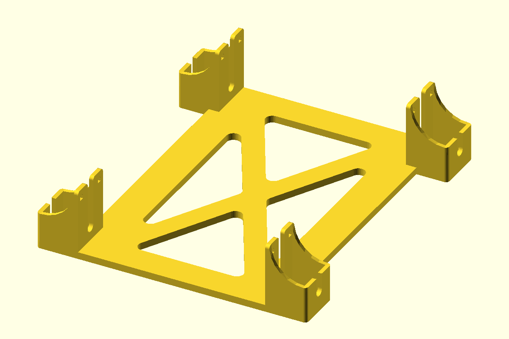
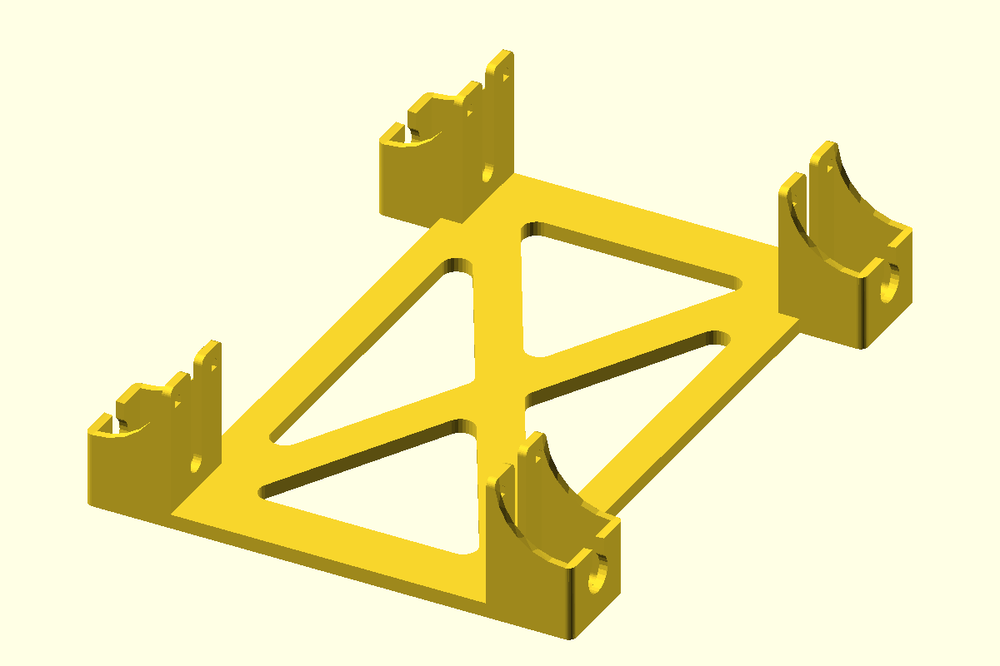
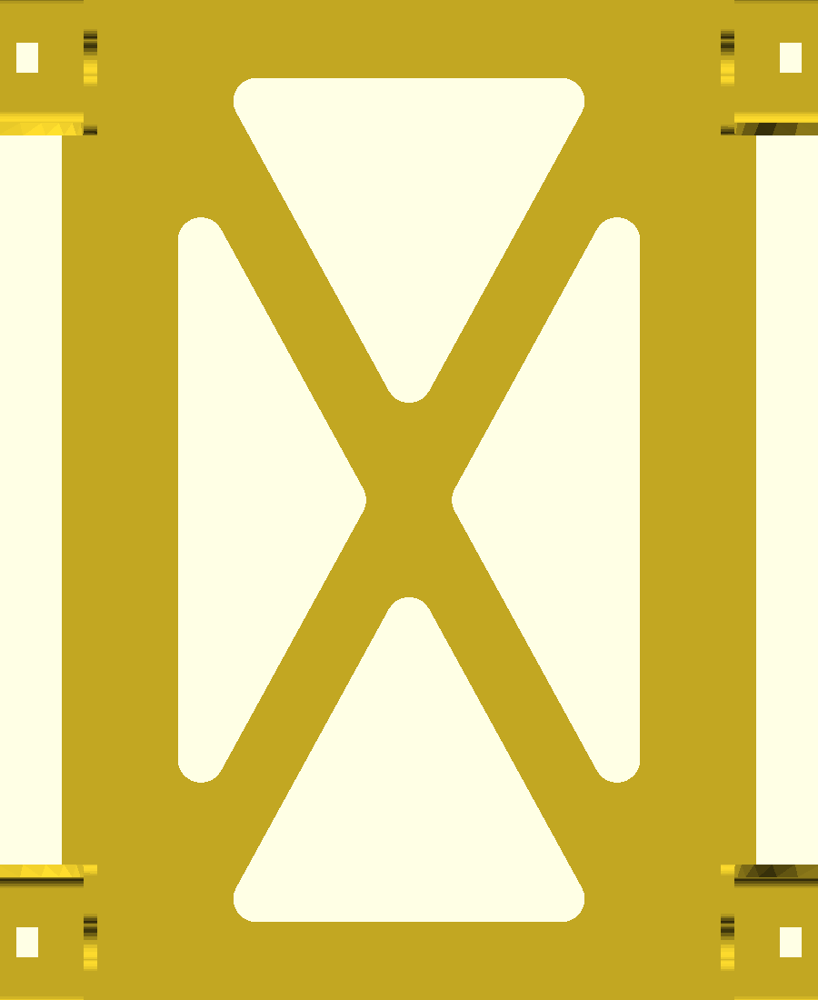
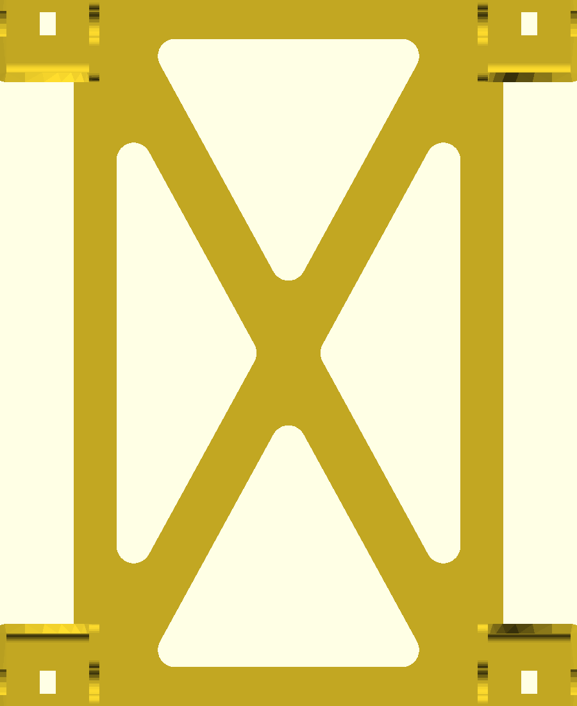

# Chassis: rev 1 → rev 2

*2026-07-03 · after the first four-wheel spin test on rev 1*

Two problems surfaced when the mecanum wheels went onto the printed rev 1
chassis: the wheel hubs didn't fit through the cradle wall openings, and the
deck was wider than it needed to be. Rev 2 fixes both — **hub bores enlarged
Ø6 → Ø10 mm** (with an entry slot so the hub drops in) and the **deck narrowed
by 20 mm**.

## Side by side

| rev 1 — printed & tested | rev 2 — printing |
|:---:|:---:|
|  |  |
|  |  |
| 156 × 180 × 40 mm | **136** × 180 × 40 mm |

## What changed, by the numbers

Generated with `cadlab diff` from the exact STEP geometry:

| Metric | rev 1 | rev 2 | Δ | Δ% |
|---|---|---|---|---|
| Bounding box X (mm) | 156.0 | 136.0 | −20.0 | **−12.8%** |
| Bounding box Y (mm) | 180.0 | 180.0 | 0 | — |
| Bounding box Z (mm) | 40.0 | 40.0 | 0 | — |
| Volume (mm³) | 77,289 | 62,548 | −14,741 | **−19.1%** |
| Surface area (mm²) | 56,000 | 48,421 | −7,580 | −13.5% |
| PLA @ 100% infill (g) | 95.8 | 77.6 | −18.2 | −19.0% |
| Solids | 5 | 5 | 0 | — |

Almost all of the removed volume is the deck narrowing; the bore enlargement
is geometrically small but is the change that makes the wheels mountable.

## The hub bore, in cross-section

Both revisions sliced by the **same plane** (x = −66 mm, through the
front-left motor cradle, perpendicular to the wheel axle). Gray fill is
rev 1; orange outline is rev 2:


Rev 1's cradle wall had only a Ø6 shaft pass-through — the small gap visible
in the gray wall. Rev 2 opens it to a **Ø10 bore with a slot out to the motor
pocket**, so the wheel's hub collar passes through the wall instead of
colliding with it, and there's clearance around the hub while it spins.

Measured straight from the STEP's cylindrical faces (four bores each):

| | rev 1 | rev 2 |
|---|---|---|
| Hub bore radius | 3.0 mm | **5.0 mm** |
| Bore axis | along X (wheel axle), center 10.3 mm above the deck | unchanged |
| Cradle saddle (motor seat) | r 19.3 mm | unchanged |

The full-height slice (both left cradles, same plane) for context:


## Reproducing this page's data

```sh
uv run --project tools/cadlab cadlab diff \
    cad/step/tt-mount-chassis-1.step cad/step/tt-mount-chassis-2.step
```

The cross-sections are exact BREP cuts (build123d slab-intersection at
x = −66, exported with `ExportSVG`), not mesh slices — the STL tessellation
isn't watertight enough for OpenSCAD's CGAL projection. Bore radii come from
enumerating the STEP's cylindrical faces (`GeomType.CYLINDER`).
