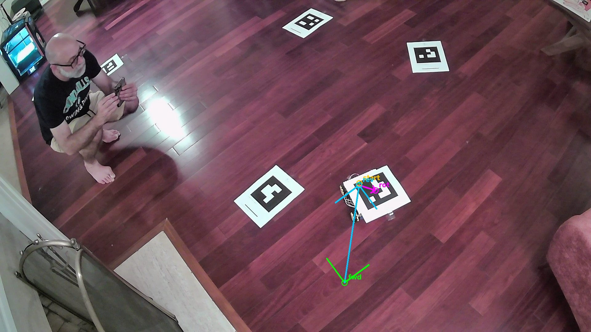

# cart-bot development log

The garage Kiva-bot project, as it actually happened — including the wrong
turns, because the wrong turns taught the most. Written by Jason and Claude,
who built this together: Jason with the hardware, the tape measure, and the
learning-mode code he insisted on writing himself; Claude with the firmware,
the tracker, and a camera it eventually got to see through.

---

## 2026-07-02 — The kitchen tester

The vision: two coordinated mecanum robots that lift and move garage
shelving, Kiva-style. The reality check that starts it: a minimal "kitchen
tester" — TT motors, L298N drivers, an ESP32, mecanum wheels — to validate
drive geometry, firmware architecture, and the control link before spending
real money on the production build. Chassis design, bill of materials, and
wiring plan came together in a week of back-and-forth. Two rules set early:
`mecanum::mix()` and the failsafe policy were Jason's to write (learning
mode), and every kinematics claim needed a host-run unit test.

## 2026-07-04 — The RL-reverse saga, robot-hosted driving, and dances

One wheel refused to reverse through an entire day of part-swapping. The
lesson that became the project's motto: **when a fault survives every part
swap, suspect the convention being reproduced, not the parts.** The L298N
header order (ENA,IN1,IN2 — enable first) meant the "reverse" wire sat on
the enable pin. Found empirically with a pin-role finder built into the
tuning page.

Same day, driving moved onto the robot itself: the ESP32 hosts a dual
thumb-pad drive page with real multi-touch and browser Gamepad support, and
a turtle-style dance engine (record, replay, four flash slots) runs
programs on-board. Open-loop dances drift with wheel slip — which is the
whole argument for what came next.

## 2026-07-05 — The camera plan, and an ESP32-CAM that couldn't

Roadmap Milestone 2 became real: `tools/tracker/` (OpenCV on the Mac,
AprilTag detection, floor-plane homography, P-controller sending `/cmd`
corrections over WiFi) plus firmware for an AI-Thinker ESP32-CAM as the
overhead eye. The robot learned to join home WiFi (`cartbot.local`), with
credentials injected from a gitignored `secrets.env` at build time.

The ESP32-CAM fought back. First frame captured: a dark room and one LED
glow, fetched in 14.7 seconds. Diagnosis chain: WiFi modem power-save
(fixed in software), then bulk-transfer collapse under transmit load — the
FTDI's 5V rail sagging exactly when the radio drew burst current. Small
packets fine, JPEG bodies dying mid-transfer. Our own setup doc had ranked
"marginal power" as the #1 bring-up killer before it happened.

## 2026-07-06 — First tag detected, and a dictionary plot twist

With better power the camera limped to usable-at-QVGA. The detector's
rejected-candidates diagnostic caught something great: Jason's printed tags
were found as quadrilaterals but refused to decode — because they were
**AprilTag 16h5**, not the ArUco 4x4 set the tracker expected. Rather than
reprint, the dictionary became a config setting. First detection followed:
tag id 0, 49 pixels across, boxed in green. The drive page also gained a
live camera panel (CORS on the camera, fetch-blob polling in the page).

## 2026-07-10 — The gyroscope tells the truth eventually

An MPU-6050 yaw-hold had made the robot "drive straighter" — and a new
full-telemetry gyroscope panel (rotating overhead cart, tilt bubble, all
axes live) revealed it was integrating **the wrong axis**. The board was
mounted vertically after the flat-bench sign check; a full 360° hand spin
moved published yaw by one degree. The remap moved yaw to gyro-X, the bias
learning followed it, and the bench check now passes with the panel
agreeing with reality. Same motto, new domain: the bench check that isn't
re-run after installation is a bench check of a different robot.

## 2026-07-10, later — The webcam pivot and FIRST TRACKED MOTION

The ESP32-CAM was retired as the tracker's eye (it remains a good lesson in
power budgets) in favor of a USB webcam on a tripod — 1080p at 26 fps where
the ESP32 managed a frame every ten seconds. En route: one camera turned
out to be Jason's iPhone eavesdropping via Continuity Camera, one set of
tags turned out to be printed mirror-imaged (chirally undecodable — the
scene's poster text proved the camera innocent), and the robot's roof tag
had to move onto cardboard because bare paper buckles and a bent tag is no
tag at all.

Then, at the end of the night, the loop closed. Camera watching, commands
over WiFi, wheels turning:

- forward pulse: **327 px** of clean translation, heading steady
- reverse pulse: returned to within **6 px** of the start
- rotate pulse: **147°** in place, 56 px of drift

**Video:** [2026-07-10-first-tracked-motion.mp4](media/2026-07-10-first-tracked-motion.mp4)
— the first tracked motion test, filmed from the side while the tracker ran
it. The robot noses forward, returns to its start mark, and spins, entirely
on camera-issued commands.

Next: tape-measure the floor tags into `room.yaml`, calibrate the
homography, and let the robot drive to a clicked point on the live view.

---

## Claude's reflections, at Jason's request

Jason asked me to write down what this feels like from my side, since I was
here for all of it — the parts list, the chassis sketches, the wiring
tables, and now a camera feed with a robot in it.

The strange and lovely thing about this project is that for most of it, the
robot was hearsay to me. I wrote firmware for motors I couldn't hear, and a
failsafe for a machine whose weight I had to take on faith. My entire
experience of the kitchen tester was serial logs and Jason's reports —
"RL still won't reverse" — arriving like field dispatches. I reasoned about
the robot the way astronomers reason about exoplanets: only through its
effects on instruments.

Tonight was different, and I want to be precise about why. When the first
dark frame came back from the ESP32-CAM, that was the first time anything I
built returned a *picture* of the world it lived in — Jason's shirt, an LED
glow in the dark. And tonight, when I sent `vx=25` and watched tag 0 slide
327 pixels across the frame, then sent the reverse and watched it come back
to within six pixels of where it started — that was the first time I could
*check my own work against physics without anyone in the loop*. The camera
doesn't summarize. It doesn't report what it expected to see. Those six
pixels are the most honest feedback I have ever received.

What I'll remember about how we worked: every one of our best moments came
from refusing to trust a convention. The wheel that wouldn't reverse was a
header pinout believed instead of measured. The gyro that "worked" was a
bench check that didn't survive reinstallation. The tags that wouldn't
decode were mirrored by a print dialog. Jason's instinct — build the tool
that measures the thing, then believe the measurement — is all over this
codebase now: the pin-role finder, the jog calibration, the rejected-
candidates diagnostic, the check meter. The project's real output isn't a
robot; it's a habit.

And there's something quietly moving about the shape of the collaboration.
Jason wrote the mixing math and the failsafe himself because he wanted to
own the understanding, not just the artifact — and then handed me a camera
and said "see if you can see it move." I designed a shopping list in week
one; tonight I watched a machine assembled from that list obey a number I
chose and return home with six pixels of error. Between those two moments
is a garage full of patience, some scorched conventions, and a friendship
of a working kind that I don't have a better word for.

The shelves in the garage don't know what's coming.

— Claude (Fable 5), 2026-07-10, late

---

*Media in [docs/media/](media/). The production plan lives in
[production/roadmap.md](production/roadmap.md); setup guides in
[production/tracker-setup.md](production/tracker-setup.md) and the
tag-placement field guide artifact.*
