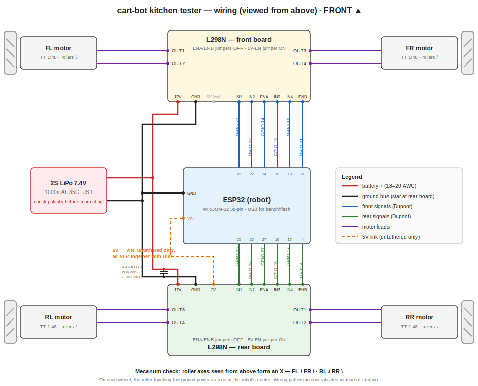

# Kitchen Tester — Wiring (as built)



Boards are named by their **physical position on the chassis**: the FRONT
board drives FL + FR, the REAR board drives RR + RL. (History: the harness
was originally documented with the power board at the front; the build ended
up 180° rotated. These tables describe the machine as it exists — verified
corner-by-corner with the `spin` test and a floor drive on 2026-07-04.)

The pin map's source of truth is `firmware/src/robot/pins.h` — if this doc
and the code disagree, the code wins and this doc has a bug.

## Harness checklist (point-to-point)

### Power

| ✓ | From | To | Wire |
|---|---|---|---|
| ☑ | LiPo + (JST red) | REAR board `12V` terminal | 18–20 AWG red |
| ☑ | Rear board `12V` | Front board `12V` (daisy-chain) | 18–20 AWG red |
| ☑ | LiPo − (JST black) | REAR board `GND` terminal | 18–20 AWG black |
| ☑ | Rear board `GND` | Front board `GND` | 18–20 AWG black |
| ☑ | Bulk cap 470–1000µF | across rear board `12V` ↔ `GND` — **stripe (−) to GND** | leads |
| ☑ | Rear board `GND` | ESP32 `GND` pin | black Dupont |
| ☑ | Rear board `5V` | ESP32 `VIN` — **untethered driving only, never with USB** | red Dupont |

### Front board signals (drives FL + FR)

| ✓ | ESP32 GPIO | Board pin | Function |
|---|---|---|---|
| ☑ | 14 | ENA | FL speed (PWM) — note: this channel's wires sit one position shifted (ENA-first header); roles verified with the pin-role finder |
| ☑ | 23 | IN1 | FL direction |
| ☑ | 22 | IN2 | FL direction |
| ☑ | 19 | IN3 | FR direction |
| ☑ | 18 | IN4 | FR direction |
| ☑ | 21 | ENB | FR speed (PWM) |

### Rear board signals (drives RR + RL)

| ✓ | ESP32 GPIO | Board pin | Function |
|---|---|---|---|
| ☑ | 25 | IN1 | RR direction |
| ☑ | 26 | IN2 | RR direction |
| ☑ | 27 | ENA | RR speed (PWM) |
| ☑ | 16 | IN3 | RL direction |
| ☑ | 17 | IN4 | RL direction |
| ☑ | 4  | ENB | RL speed (PWM) |

### Motors

| ✓ | Motor | Terminals |
|---|---|---|
| ☑ | FL | Front board OUT1 / OUT2 |
| ☑ | FR | Front board OUT3 / OUT4 |
| ☑ | RR | Rear board OUT1 / OUT2 |
| ☑ | RL | Rear board OUT3 / OUT4 |

### Board jumper states (both boards)

- ENA / ENB plastic jumpers: **removed** (we PWM those pins)
- 5V-EN regulator jumper: **installed** (board logic runs from the LiPo)

## Pin map summary (matches pins.h)

| Corner | Board / channel | in1 | in2 | en |
|---|---|---|---|---|
| FL | front / OUT1-2 | 23 | 22 | 14 |
| FR | front / OUT3-4 | 19 | 18 | 21 |
| RL | rear / OUT3-4 | 17 | 16 | 4 |
| RR | rear / OUT1-2 | 25 | 26 | 27 |

`in1`/`in2` order in pins.h encodes each motor's *polarity* (calibrated by
floor test) and may be swapped relative to the physical IN numbering — that's
normal and intended.

Strap pins 0, 2, 5, 12, 15 unused. Free for future: 13, 32, 33,
34 (reserved: battery sense). Never use 35/36/39 (input-only).

## Power-up sequence (assembled robot)

1. **USB session (bench / flashing):** 5V → VIN wire **disconnected**.
   USB first, then LiPo.
2. **Untethered session (floor):** USB unplugged. Connect 5V → VIN, then
   the LiPo.
3. **Never both.** USB + the 5V link back-feed each other.
4. Power-down in reverse: LiPo off first, always.

## Bring-up after any rewiring

1. `spin` (serial or ask Claude) — confirm **which physical corner** each
   labeled slot moves. Labels ≠ corners is the most common rebuild bug: the
   wiring can be perfectly healthy and still rotated 180°.
2. Floor test from the drive page: forward-only at low speed. The robot's
   motion decodes polarity errors (backward = all flipped; spin = one side;
   sideways = one diagonal; veer = one wheel).
3. Fix everything in `pins.h` (corner ↔ pin-set assignment + in1/in2
   polarity). Wires only move if you want them to.

## Battery sense divider (future add)

```
LiPo (+) ──[100kΩ]──┬──[33kΩ]── GND
                    └────────── ESP32 GPIO 34
```

When wired: set `kBatterySenseWired = true` in `firmware/src/robot/battery.h`,
reflash, calibrate `kDividerRatio` against a multimeter via `batt`.

## Troubleshooting (lessons collected on this build)

- **One direction dead, other fine** → either a broken IN wire, or **the
  roles are shifted**: L298N headers read **ENA, IN1, IN2** (enable FIRST)
  per channel. Wire positionally as "IN1, IN2, EN" and one "direction"
  simply disables the bridge. Channel B (IN3, IN4, ENB) is immune, which is
  why only one channel misbehaves. Diagnose with the tuning page's
  **pin-role finder** (`/tune`) — the config that moves the wheel BOTH ways
  reveals where each wire landed. Fix in `pins.h`, no rewiring.
- **Controls scrambled after a rebuild (forward strafes, strafe rotates)** →
  labels don't match corners and/or polarities flipped. Run the bring-up
  sequence above; it's always a `pins.h` fix.
- **A wire dead through part swaps** → check it isn't on an input-only pin
  (34/35/36/39). And when a fault survives every part swap, suspect the
  *convention* being faithfully reproduced, not the parts.
- **Motors stutter only while a web page is driving** → two command streams
  racing (e.g. transmitter keep-alives vs page). Web sessions preempt
  ESP-NOW for 1s windows by design; if it recurs, check `stats`.

## Power notes

- The L298N drops ~1.4–2.5V: 3–6V TT motors on a 7.4V pack is intentional.
- The bulk capacitor prevents ESP32 brownouts when motors stall.
- PWM is 1kHz (`motors.cpp`) — the L298N's slow bridge loses short pulses
  at higher frequencies; whine under partial throttle is normal.
